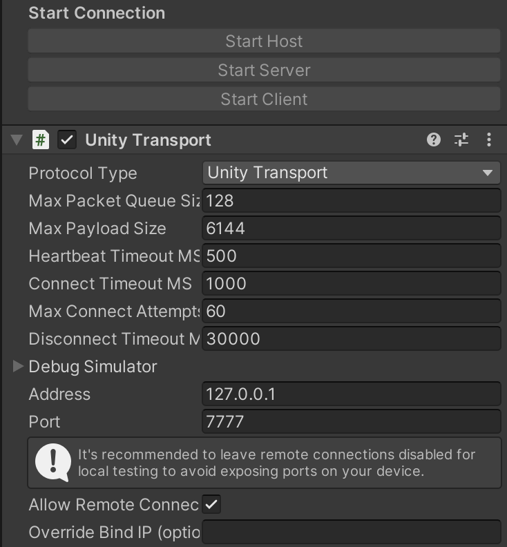

### Custom Network Manager
(This is a prefab in *Networking*)  
This is the most basic requirement needed in both the client and server. It handles all of the networking communication as well as contains a few custom modifications for the experiments. Apart from a client-connect callback that runs when the PC connects to the headset, it is mostly the same script as the netcodeGo original. Just note that when a client joins it spawns the RpcHandler and mirror objects for the hands. If you want extra functionality for a client-join you must edit this script otherwise you may never have to touch it.

There are 2 in-editor functionalities that the user must be aware of otherwise:
#### 1:
The server handles this asyncronously but the client must be connected to the server everytime. You must set the IP address in **Network Transport** under *Address* (where 127.0.0.1 is in the screenshot below) to the server and press **Start Client** on the PC in order to connect.

This can be set somewhere in code as well but if possible, is easiest to manage from the Unity editor.

#### 2:
**Network Manager Extras** is a container for access to public variables we want to associate with the NetworkManager. Unity does not allow the NetworkManager to natively display public variables in the editor so me must attach them here. In order to access all of these, in scripts use **networkManager.GetComponent<NetworkManagerExtras()>.publicVar**

**NetworkManagerExtras.cs** can have arbitrary variables assigned to provide system-startup defaults.

### Necessary Modifications
For an object to be recognized by the network there is a minimum of two requirements. It must be present in the **Network Prefab List** and have a **NetworkObject** component attached. 

The Network Prefab List is a list in the *Networking* directory that registers all network objects. It must match on both the client and server.

To track an object's movement, the component **NetworkTransform** must be attached to the object as well. (Add Component > Network Transorm)

These changes can all be added to existing prefabs to easily make them now network available. *Netorking/AugmentedReality/StreamObjectMirror* is an exmaple of the basic necessities to transmit an object. Note that this is a special object that can be mapped to track any other object in the scene who's prefab we may not care to load. This provides a spherical marker in AR.

### Rpc(Remote Procedure Call) Handler
This prefab is spawned in by the NetworkManager upon connection. It is the most likely for modification required by any functionality needed for any other experiment. The script is the most documented containing the most examples in the project. Server-client interaction/events will need to have a definition here. 

To send a command we have to suffix and guard our functions. These are necessary:  
- server -> client: \[ClientRpc], ClientRpc()
- client -> server: \[ServerRpc(RequireOwnership = false)], ServerRpc()

#### Special Functions Prefabs:
**(Text Updates)**  
The text-update system accesses the canvas attached to the network manager on the server to display text to the user. The two client functions are **TextUpdatesStatusOn(bool)** and **TextUpdates(string)**. The statusOn() function will take either *true* or *false* to display or erase the text. TextUpdates() will overwrite whatever is currently being displayed. Note that this function is only callable if StatusOn() is *true*.  

**(Spawn Registry)**  
Only the server can spawn/despawn objects so we call this from the client to create new instances. All we need is to pass the name of the prefab in the Network Prefabs List and the server will create it on both ends. Notice in the code the client API, that then calls the server API which creates the object. All Rpc's will have similar control flows. 

**KEEP IN MIND THAT FOR IF ANY REASON YOU CONNECT AND THEN DISCONNECT YOU MUST RESTART BOTH THE CLIENT AND SERVER INSTANCES**