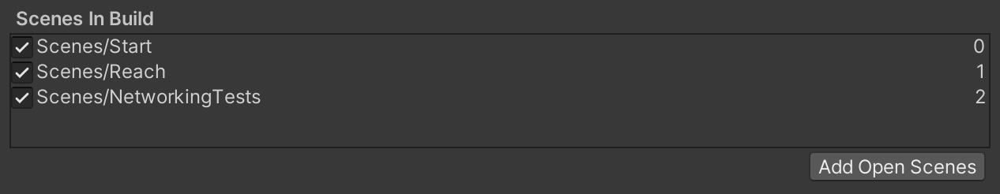
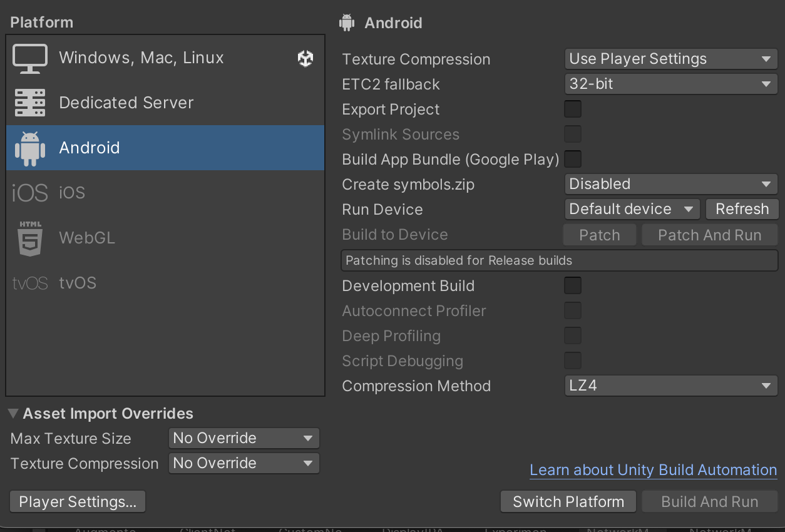

# Virtual Reality to Augmented Reality Port

This will contain examples, troubleshooting and a brief explanation what is happening to aid in moving a VR system to AR/VR hybrid. 

### Getting Started
The library used in all the networking-related scripts is **NetcodeGO**. It is the flagship networking library for Unity and as such can be installed easily using the package manager.

1. Do this by going to **Window > Package Manager**
2. Selecting **Packages: Unity Registry** from the top.
3. Importing *Netcode for Game Objects*, *TextMeshPro*

If integrating AR for the MetaQuest3 you must:
- Create a Meta developer account (online)
- Connect using the Oculus app and enable developer mode

When testing also confirm that both the headset and client (PC in most cases) is connected to the same network.

After the all this has been completed, we can merge the VR project from Unity into AR.

### Methodology
This AR port relies completely on networking to optimize the operation of the AR headset while simultaneously providing a smooth transition from existing VR experiments. For the remained of this document, the headset will be referred to as the **server** while the PC running the experiment will be the **client**, I will use those terms interchangeably with their respective machines.

All game logic and functionality is occuring on the client. The network only transmits the minimum required data. The headset acts as special goggles that let you see the into the VR world but doesn't handle any logic. This design choice was taken because the experiments still allow for the use of ROS and heavy computational tasks can be maintained on the PC without creating lag in to AR headset. 

This decoupling means anytime we want to spawn an object, despawn an object, update certain values or trigger events from the client according to the experiment logic, we must send a special request to the server which will then respond by updating both ends. (Game logic updates are handled by the PC) 

In practice the headset and PC both have two separate *unity instances* that need to be run simultaneously because AR/VR requires different targets. One gets compiled to the headset and only contains the necessary components for AR and the other contains the experiment itself running on the PC. Both need the necessary networking configurations to communicate.

### Unity Editor Requirements
I will highlight the necessary changes needed to facilitate the networking that Unity needs.

In File > Build Settings:  
All scenes that we desire to be networked must be named the same and in the same order on both the client and server instances.

The server build must also be set to Android 32-bit with the target being the MetaQuest3. To test if the AR is working you must **Build & Run** the client to the headset. It is only necessary to recompile though if you are adding new network objects or changed one of the networking scripts (CustomNetworkManager.cs, RpcHandler.cs, etc.)

